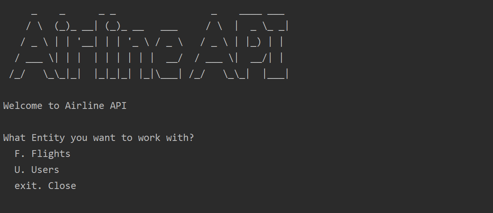
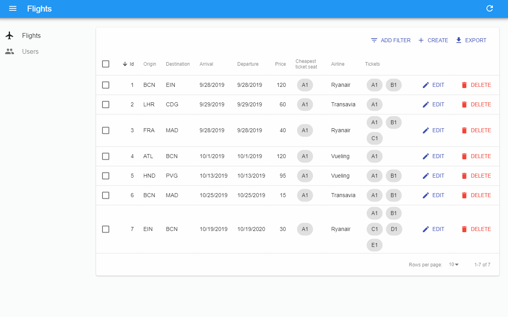

# SoT REST assignment | Airline | 2019 Q1 B1 - Fontys ICT

```
     _    _      _ _                 _    ____ ___ 
    / \  (_)_ __| (_)_ __   ___     / \  |  _ \_ _|
   / _ \ | | '__| | | '_ \ / _ \   / _ \ | |_) | | 
  / ___ \| | |  | | | | | |  __/  / ___ \|  __/| | 
 /_/   \_\_|_|  |_|_|_| |_|\___| /_/   \_\_|  |___|
                                                   
```

🛠 This project was develop with GitHub, Intellij Idea, Java 11 and React.js.<br>
**Source code**: https://github.com/mauriciabad/SoT-REST

**Author**: [Maurici Abad Gutierrez](https://mauriciabad.com)

Done entirely in only 5 days.

> Grade: 10

## Assignment statement

Make a REST service and client(s) for the required case: **searching and buying flight tickets (for travelling with an airplane)**. You may make it simple or advanced, for example: clients can create account, search for flight tickets and buy them, etc.

Detailed assessment criteria can be found here: [SOT Module Description and Assignments](https://github.com/mauriciabad/SoT-REST/blob/master/documentation/SOT_Module_Description_and_Assignments.pdf).

## API Reference

This are all the available resources for Airline's API 1.0.

> **Base URL**: [http://localhost:8080/airline/v1/](http://localhost:8080/airline/v1/)

### Endpoints

#### Flights

| Method | Endpoint | Description | Response |
|--------|----------|-------------|----------|
| GET    | /flights | Get all flights filtered by the Query parameters: <br>`flightId`, `origin`, `destination`, `departure`, `departureBefore`, `departureAfter`, `arrival`, `arrivalBefore`, `arrivalAfter`, `price`, `maxPrice` and/or `airline`. <br>This dates must have this format: `YYYYY-MM-dd` | Array\<Flight\> |
| POST   | /flights | Create a new flight <br>Also accepts `x-www-form-urlencoded` | Flight |
| GET    | /flights/{flightId} | Get information about a specific flight | Flight |
| PUT    | /flights/{flightId} | Update `origin`, `destination`, `departure`, `arrival` and/or `airline` of a flight. | Flight |
| DELETE | /flights/{flightId} | Delete a flight | |

#### Flights Tickets

| Method | Endpoint | Description | Response |
|--------|----------|-------------|----------|
| GET    | /flights/{flightId}/tickets | Get all tickets | Array\<Ticket\> |
| POST   | /flights/{flightId}/tickets/{ticketId}/buy?buyerId={userId} | Buy a specific ticket. <br>Needs `buyerId` Query parameter | Ticket |

#### Users

| Method | Endpoint | Description | Response |
|--------|----------|-------------|----------|
| GET    | /users | Get all users | Array\<User\> |
| POST   | /users | Create a new user | User |
| GET    | /users/{userId} | Get information about a specific user | User |
| PUT    | /users/{userId} | Update a user | User |
| DELETE | /users/{userId} | Delete a user | |

### Objects

#### Flight

| Name | Type |
|------|------|
| id | int |
| origin | String |
| destination | String |
| departure | String `yyyy-MM-dd HH:mm` |
| arrival | String `yyyy-MM-dd HH:mm` |
| airline | String |
| tickets | Array\<Ticket\> |
| *price* | int |
| *cheapestTicket* | Ticket |

> **Notice**:
> - The attribute `price` is the price of the cheapest ticket.
> - The attributes `price` and `cheapestTicket` are redundant information.

#### Ticket

| Name | Type |
|------|------|
| id | int |
| price | int |
| seat | String |
| buyerId | int |
| forSale | bool |

#### User

| Name | Type |
|------|------|
| id | int |
| name | String |

## General comments

- All the data is encoded in `json` format.
- ID's are generated automatically, if you provide one in a POST or PUT request this will be ignored.
- When a list is requested the response contains the header `X-Total-Count` with the amount of items in the list.
- CORS enabled with header `Access-Control-Allow-Origin: *`.
- `OPTIONS` method is also implemented.
- Flights can be filtered by all this parameters: `flightId`, `origin`, `destination`, `departure`, `departureBefore`, `departureAfter`, `arrival`, `arrivalBefore`, `arrivalAfter`, `price`, `maxPrice` and/or `airline`.

## 1st Client - Java console



Run the class [`Main`](https://github.com/mauriciabad/SoT-REST/blob/master/client/src/main/java/Main.java) inside `client` module.

> **Note**: you can write the options in lowercase and will still work.

> **Disclaimer 1**: I wanted to make a preatier display of the entities, instead of just writing the JSON. But because working with JSON in Java is a nightmare I left like this.

> **Disclaimer 2**: *The Intellij Idea console made me code dirty workarrounds*. 
> - No Unicode support.
> - The `Console` class is incompatible.
> - The graddle run button doesn't work straight away. 
> 
> So I couldn't use fancy Emojis, I had to make my own Console class, and running the code must be done from the regular Intellij Play button...

## 2nd Client - Web React.js




You MUST run the app in localhost, or open the file `[/web-client/build/index.html](https://github.com/mauriciabad/SoT-REST/blob/master/web-client/build/index.html)` from the computer.

- The source code is inside the `/web-client` folder. 
- The compiled files are inside the `/web-client/build` folder. 

> I used the [react-admin](https://marmelab.com/react-admin/) framework to build it.

_When you deploy the apache tomcat server it will give you nice instructions about how to run the 2nd client._

## Error handling

Some errors can occur when:
- A required parameter is missing.
- The specified item does not exist.
- Date parameter has wrong format.
- Try to buy a ticket not for sale.

### Example custom error message

```json
{
  "error": true,
  "message": "Flight with flightId 999 doesn't exist",
  "status": 404,
  "statusName": "Not Found"
}
```

### Implementing a Composite service

The idea I had is the **Custom Flights Recomendation**. 

One use case would be:
1. Ask the costumer's favorite football team.
1. Call a `Football API` to know when and where is the next match.
1. Call our `Airline API` to get the flights there.
1. Check in a `Weather API` the weather for the departure and arival times.
1. Send a recomendation emailthrought `Mailing API` with all that information to the costumer.

This would call several services from one service.

## HTTP messages

Real HTTP messages being transferred between client and server. 

We can see the input and output of some CRUD operations of `/flights` and different kinds of encodings.

| Request | Response |
|:-------:|:--------:|
|  `GET` `/flights/1` |  `GET` `/flights/1` |
|  `GET` `/flights` |  `GET` `/flights` |
|  `GET` `/flights?origin=BCN` `query` |  `GET` `/flights?origin=BCN` `query` |
|  `POST` `/flights` `json` |  `POST` `/flights` `json` |
|  `POST` `/flights` `form` |  `POST` `/flights` `form` |
|  `POST` `/flights` `json` |  `POST` `/flights` `json` |
|  `PUT` `/flights/1` `json` |  `PUT` `/flights/1` `json` |
|  `DELETE` `/flights/1` |  `DELETE` `/flights/1` |
|  `GET` `/flights` |  `GET` `/flights` |
