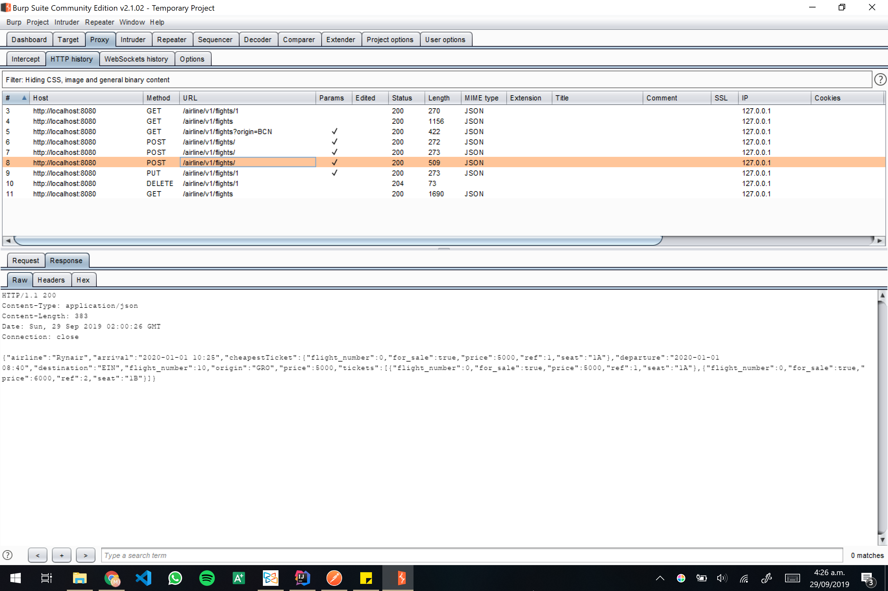

# SoT REST assignment | Airline | 2019 Q1 B1 - Fontys ICT

✈ First REST assignment for SoT 2019 Q1 B1 in Fontys ICT.

The code is here: https://github.com/mauriciabad/SoT-REST

## Assignment statement

Make a REST service and client(s) for the required case: **searching and buying flight tickets (for travelling with an airplane)**. You may make it simple or advanced, for example: clients can create account, search for flight tickets and buy them, etc.

Detailed assessment criteria can be found here: [SOT Module Description and Assignments](documentation/SOT_Module_Description_and_Assignments.pdf) 

## API Reference

This are all the available resources for Airline's API 1.0.

> **Base URL**: [http://localhost:8080/airline/v1/](http://localhost:8080/airline/v1/)

### Endpoints

#### Flights

| Method | Endpoint | Description | Response |
|--------|----------|-------------|----------|
| GET    | /flights | Get all flights filtered by the Query parameters: <br>`flightNumber`, `origin`, `destination`, `departure`, `departureBefore`, `departureAfter`, `arrival`, `arrivalBefore`, `arrivalAfter`, `price`, `maxPrice` and/or `airline`. <br>This dates must have this format: `YYYYY-MM-dd` | Array\<Flight\> |
| POST   | /flights | Create a new flight <br>Also accepts `x-www-form-urlencoded` | Flight |
| GET    | /flights/{flightNumber} | Get information about a specific flight | Flight |
| PUT    | /flights/{flightNumber} | Update `origin`, `destination`, `departure`, `arrival` and/or `airline` of a flight. | Flight |
| DELETE | /flights/{flightNumber} | Delete a flight | |

#### Flights Tickets

| Method | Endpoint | Description | Response |
|--------|----------|-------------|----------|
| GET    | /flights/{flightNumber}/tickets | Get all tickets | Array\<Ticket\> |
| POST   | /flights/{flightNumber}/tickets/{ticketId}/buy?buyerId={userId} | Buy a specific ticket. <br>Needs `buyerId` Query parameter | Ticket |

#### Users

| Method | Endpoint | Description | Response |
|--------|----------|-------------|----------|
| GET    | /users | Get all users | Array\<User\> |
| POST   | /users | Create a new user | User |
| GET    | /users/{userId} | Get information about a specific user | User |
| PUT    | /users/{userId} | Update a user | User |
| DELETE | /users/{userId} | Delete a user | |

### Objects

#### Flight

| Name | Type |
|------|------|
| flightNumber | int |
| origin | String |
| destination | String |
| departure | String `YYYYY-MM-ddThh:mm` |
| arrival | String `YYYYY-MM-ddThh:mm` |
| airline | String |
| tickets | Array\<Ticket\> |

#### Ticket

| Name | Type |
|------|------|
| ref | int |
| flightNumber | int |
| price | int |
| seat | String |
| buyerId | int |
| forSale | bool |

#### User

| Name | Type |
|------|------|
| userId | int |
| name | String |

### General comments

- All the data is encoded in `json` format.
- ID's are generated automatically, if you provide one in a POST or PUT request this will be ignored.

## 1st Client - Java console


## 2nd Client - Web

It's in side the `/web-client` folder. You can use it from the link below if you are running the backend in localhost:

[/web-client/index.html](https://mauriciabad.github.io/SoT-REST/web-client/)

## Error handling

Some errors can occur when:
- A required parameter is missing.
- The specified item does not exist.
- Date parameter has wrong format.

Example custom error messages:

```json
{
    "error": true,
    "message": "Flight with flightNumber 999 doesn't exist",
    "status": 404,
    "statusName": "Not Found"
}
```

## HTTP messages

Real HTTP messages being transferred between client and server. 

We can see the input and output of some CRUD operations of `/flights` and different kinds of encodings.

| Request | Response |
|:-------:|:--------:|
|  `GET` `/flights/1` |  `GET` `/flights/1` |
|  `GET` `/flights` |  `GET` `/flights` |
|  `GET` `/flights?origin=BCN` `query` |  `GET` `/flights?origin=BCN` `query` |
|  `POST` `/flights` `json` |  `POST` `/flights` `json` |
|  `POST` `/flights` `form` |  `POST` `/flights` `form` |
|  `POST` `/flights` `json` |  `POST` `/flights` `json` |
|  `PUT` `/flights/1` `json` |  `PUT` `/flights/1` `json` |
|  `DELETE` `/flights/1` |  `DELETE` `/flights/1` |
|  `GET` `/flights` |  `GET` `/flights` |
